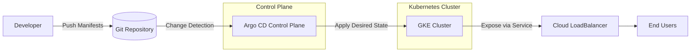
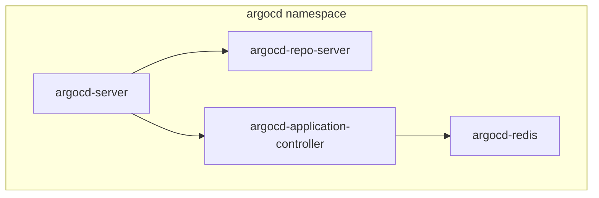
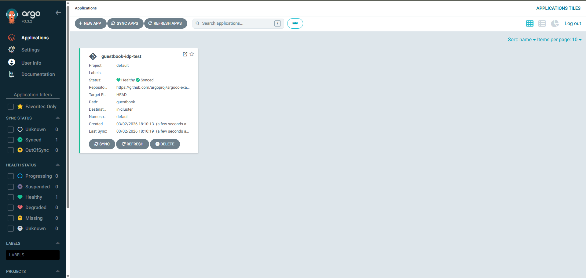
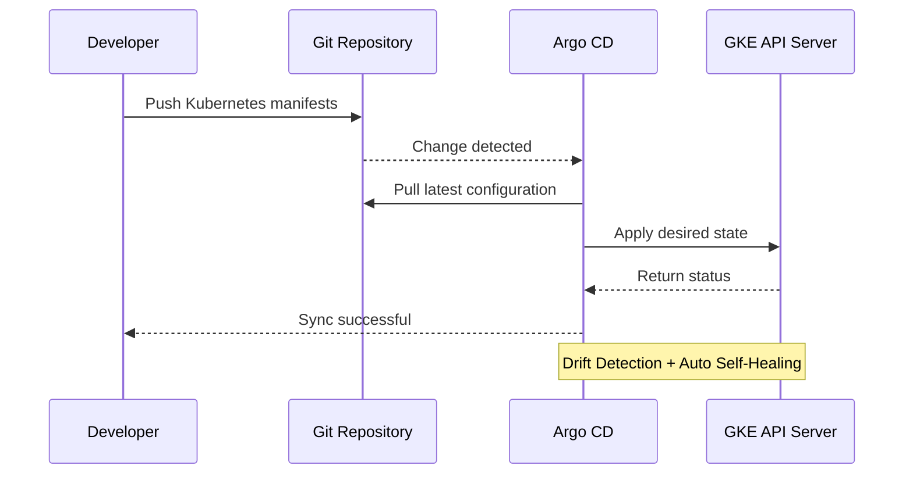

# ☁️ GitOps Internal Developer Platform (IDP) on GKE


> A production-grade GitOps Internal Developer Platform built on Google Kubernetes Engine (GKE) using Argo CD as the Continuous Delivery control plane.

This platform implements a **Single Source of Truth model**, where Kubernetes cluster state is continuously reconciled against Git repositories — enabling automated deployments, drift detection, and self-healing infrastructure.

---

# 📌 Table of Contents

* [Architecture Overview](#-architecture-overview)
* [Live Dashboard](#-live-dashboard)
* [GitOps Flow](#-gitops-flow)
* [Core Capabilities](#-core-capabilities)
* [Technical Stack](#-technical-stack)
* [Cluster Optimization Strategy](#-cluster-optimization-strategy)
* [Deployment Guide](#-deployment-guide)
* [Operational Playbook](#-operational-playbook)
* [Future Enhancements](#-future-enhancements)

---

# 🏗 Architecture Overview

## High-Level System Architecture



---

## Argo CD Internal Component Layout



---

# 📊 Live Dashboard

## Argo CD Sync Dashboard (GKE Cluster)

The screenshot below shows a successfully synchronized and healthy application running on the tested GKE cluster.

<p align="center">
  
</p>

**Figure 1:** Argo CD dashboard displaying applications in `Synced` and `Healthy` state with automated reconciliation enabled.

### 🔎 Sync Health Indicators

* 🟢 **Healthy** – Live cluster state matches desired state
* 🔄 **Synced** – No configuration drift detected
* ✂️ **Auto-Prune Enabled** – Orphaned resources removed
* 🛡 **Self-Heal Enabled** – Drift automatically corrected

This dashboard reflects a live GitOps control plane operating within a resource-constrained 2-node GKE cluster.

---

# 🔄 GitOps Flow

## Continuous Reconciliation Sequence



---

# 🚀 Core Capabilities

### ✅ GitOps-Based Continuous Delivery

* Declarative infrastructure
* Git as the single source of truth
* Automated sync policy enabled

### ✅ Self-Healing Infrastructure

* Real-time drift detection
* Automatic reconciliation
* Resource pruning for stale objects

### ✅ Resource-Constrained Optimization

* Runs on a 2-node GKE cluster
* Tuned to operate within GCE quota limits
* Control plane stabilized under limited compute

### ✅ Scalable Application Onboarding

* Application CRDs for lifecycle management
* Namespace isolation
* Automated deployment pipelines

---

# 🛠 Technical Stack

| Layer                   | Technology                     |
| ----------------------- | ------------------------------ |
| Cloud Provider          | Google Cloud Platform          |
| Container Orchestration | Google Kubernetes Engine (GKE) |
| Continuous Delivery     | Argo CD (v3.3.2)               |
| IaC                     | Kubernetes YAML Manifests      |
| Networking              | GKE LoadBalancer (Layer 4)     |
| Authentication          | gcloud + Kubernetes RBAC       |

---

# ⚙ Cluster Optimization Strategy

This platform was engineered to operate within a **2-node cluster constraint** while maintaining control plane stability.

## Resource Squeeze Profile

| Component                     | CPU Request | Memory Request |
| ----------------------------- | ----------- | -------------- |
| argocd-server                 | 100m        | 256Mi          |
| argocd-repo-server            | 50m         | 128Mi          |
| argocd-redis                  | 50m         | 64Mi           |
| argocd-application-controller | 100m        | 256Mi          |

### Optimization Goals

* Prevent `Pending` pod states
* Avoid compute starvation
* Stay within GCE quota limits
* Maintain operational stability

---

# 📖 Deployment Guide

## 1️⃣ Connect to Cluster

```bash
gcloud container clusters get-credentials gitops-cluster --region us-central1
```

---

## 2️⃣ Retrieve Argo CD Admin Credentials

```bash
kubectl -n argocd get secret argocd-initial-admin-secret \
-o jsonpath="{.data.password}" | base64 -d; echo
```

---

## 3️⃣ Onboard a New Application

Example: `student-os-service`

```yaml
apiVersion: argoproj.io/v1alpha1
kind: Application
metadata:
  name: student-os-service
  namespace: argocd
spec:
  source:
    repoURL: <YOUR_REPO_URL>
    path: k8s-manifests
  destination:
    server: https://kubernetes.default.svc
    namespace: default
  syncPolicy:
    automated:
      prune: true
      selfHeal: true
```

Apply:

```bash
kubectl apply -f student-os-application.yaml
```

---

# 🛡 Operational Playbook

## Credential Expiration

```bash
gcloud auth login
```

---

## Diagnose Pending Pods

```bash
kubectl describe pod <pod-name>
```

Check for:

* `Insufficient cpu`
* `Insufficient memory`

---

## Verify Sync Status

```bash
kubectl get applications -n argocd
```

---

# 📈 Future Enhancements

* Multi-cluster GitOps federation
* OIDC authentication integration
* RBAC-based multi-team access
* Horizontal Pod Autoscaler tuning
* Observability stack (Prometheus + Grafana)
* Policy-as-Code (OPA / Gatekeeper)

---

# 🏆 Project Impact

This project demonstrates:

* Production-grade GitOps implementation
* Cost-aware Kubernetes architecture
* Infrastructure reliability under constraint
* Advanced DevOps & Platform Engineering practices
* Live cluster validation with automated reconciliation

---

# 📄 License

MIT License

---
